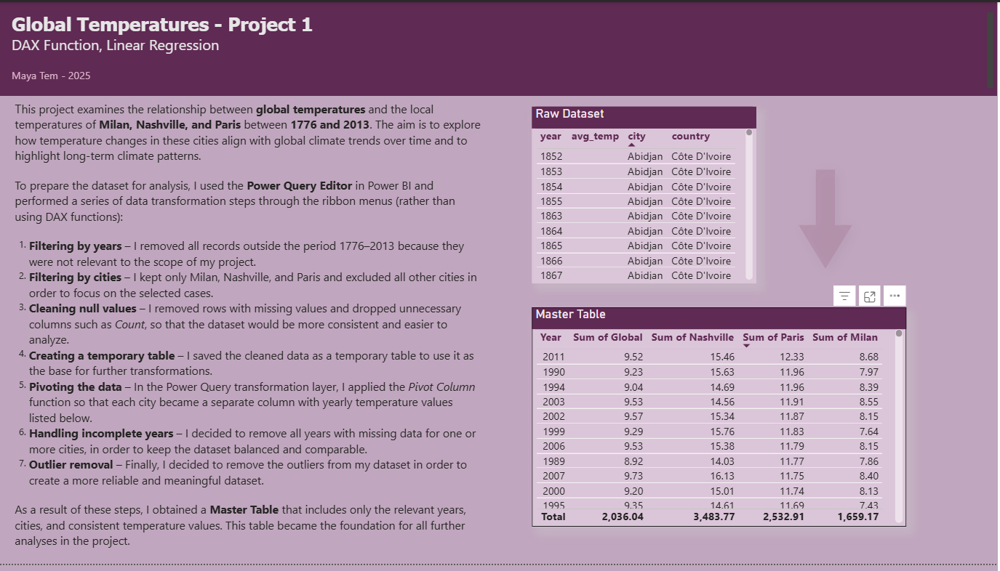
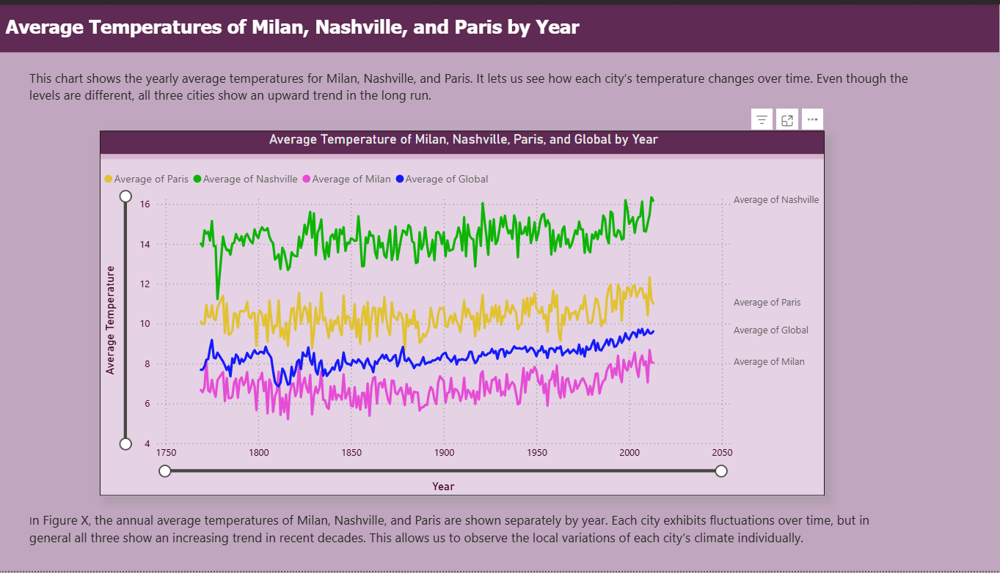
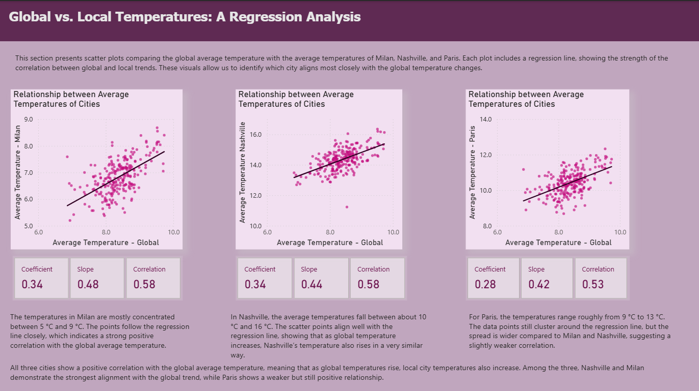

# 🌍 Global vs Local Temperature Analysis
### Power BI | DAX | Linear Regression
  ## 📊 Data Preparation & Master Table

## 📌 Project Overview

This project analyzes the relationship between global temperature trends and the local average temperatures of Milan, Nashville, and Paris between 1776 and 2013.

## The objective is to understand:

- How closely local cities follow global warming trends
- Which city aligns most strongly with global temperature changes
- The strength of correlation between global and local temperature patterns

This project demonstrates data transformation, DAX calculations, correlation analysis, and regression modeling in Power BI.

## 📊 Business / Analytical Objective

Understanding how local climates respond to global temperature changes helps:
- Identify regional climate sensitivity
- Compare temperature volatility across cities
- Quantify correlation strength using statistical measures
- Support long-term environmental trend analysis

## 🗂 Dataset

Public historical temperature dataset including:
- Year
- Average Temperature
- City
- Country

Cities analyzed:
- Milan
- Nashville
- Paris

Time range filtered: 1776–2013
## 📈 Average Temperatures by Year

## 🔄 Data Preparation (Power Query)

Data cleaning and transformation steps included:

1. Filtering years (1776–2013)
2. Filtering selected cities
3. Removing null values
4. Removing incomplete years
5. Pivoting cities into columns
6. Outlier removal
7. Creating a master table for analysis

The cleaned dataset became the foundation for all further modeling.

## 📈 Analysis Performed
### 1️⃣ Trend Analysis (Time Series)
- Yearly temperature trends were visualized for:
- Global average
- Milan
- Nashville
- Paris

All cities show a clear upward trend over time, consistent with global warming patterns.

### 2️⃣ Correlation Heatmap

A correlation matrix was created to measure alignment between global and local temperatures.

Key Findings:

- Milan has the strongest correlation with global temperatures (r ≈ 0.58)
- Nashville shows moderate correlation (r ≈ 0.58)
- Paris shows slightly weaker alignment (r ≈ 0.53)

This suggests Milan’s local temperature changes most closely follow global trends.

## 🔥 Correlation Heatmap

### 3️⃣ Regression Analysis

Linear regression models were built for each city against global temperatures.

| City	| Slope	| Correlation |
| :--- | :---: | ---: |
| Milan	| 0.48	| 0.58 |
| Nashville	| 0.44	| 0.58 |
| Paris	| 0.42	| 0.53 |

Interpretation:

All cities show positive correlation
- As global temperature increases, local temperatures increase
- Milan exhibits the strongest relationship

## 📉 Regression Analysis (Global vs Local)

## 📊 Visualizations
**Data Cleaning & Master Table**

**Time Series Trends**

**Correlation Heatmap**

**Regression Analysis**

## 🛠 Tools & Technologies
- Power BI
- Power Query
- DAX
- Linear Regression
- Correlation Analysis

## 🎯 Key Insights
- Global and local temperature trends are strongly positively correlated.
- Milan demonstrates the highest alignment with global warming patterns.
- All cities show increasing temperature trends over the long term.
- Regression modeling confirms statistically significant relationships.

## 🚀 What This Project Demonstrates
- Data transformation and cleaning in Power Query
- DAX calculations and modeling
- Statistical reasoning (correlation + regression)
- Data storytelling using dashboards
- Interpretation of climate trend data

